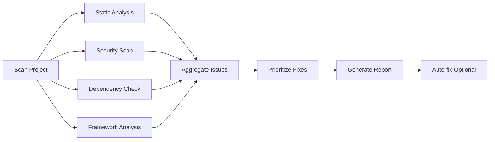

# Code Review

Le service de review de Daemon analyse votre code pour détecter les problèmes et suggérer des améliorations.

## Overview

Le review effectue plusieurs types d'analyse :

| Type | Description | Outils |
|------|-------------|--------|
| **Static Analysis** | Erreurs de syntaxe, types, unused imports | ESLint, TSC |
| **Security** | Vulnérabilités, secrets exposés | Snyk, npm audit |
| **Dependencies** | Dépendances obsolètes ou vulnérables | npm audit |
| **Performance** | Performance du code, best practices | Lighthouse, k6 |
| **NestJS** | Patterns spécifiques NestJS | NestJS Analyzer |
| **Rust** | Patterns spécifiques Rust | Clippy, rustfmt |

## Workflow



## Commandes

### Review complet

```bash
npx @oalacea/daemon review
```

### Review avec options

```bash
# Seulement analyse statique
npx @oalacea/daemon review --static-only

# Seulement sécurité
npx @oalacea/daemon review --security-only

# Exclude des patterns
npx @oalacea/daemon review --exclude "dist/**,node_modules/**"

# Sortie JSON
npx @oalacea/daemon review --json > review.json

# Auto-fix applicable
npx @oalacea/daemon review --fix
```

### Review ciblé

```bash
# Review un fichier spécifique
npx @oalacea/daemon review src/components/Button.tsx

# Review un dossier
npx @oalacea/daemon review src/services

# Review par pattern
npx @oalacea/daemon review --pattern "**/*.spec.ts"
```

## Rapport

Le rapport de review contient :

```json
{
  "summary": {
    "totalIssues": 42,
    "critical": 3,
    "high": 8,
    "medium": 15,
    "low": 16,
    "fixable": 28,
    "score": 78
  },
  "categories": {
    "static": {
      "issues": 12,
      "fixable": 10,
      "topIssues": [...]
    },
    "security": {
      "issues": 3,
      "fixable": 1,
      "topIssues": [...]
    },
    "dependencies": {
      "issues": 5,
      "fixable": 5,
      "topIssues": [...]
    },
    "performance": {
      "issues": 8,
      "fixable": 6,
      "topIssues": [...]
    },
    "code-quality": {
      "issues": 14,
      "fixable": 6,
      "topIssues": [...]
    }
  },
  "issues": [
    {
      "id": "static-src-components-Button-42",
      "category": "static",
      "severity": "high",
      "description": "'onClick' is assigned a value but never used",
      "message": "@typescript-eslint/no-unused-vars",
      "location": {
        "file": "src/components/Button.tsx",
        "line": 42,
        "column": 8
      },
      "fixable": true,
      "effort": 1,
      "ruleId": "@typescript-eslint/no-unused-vars"
    }
  ]
}
```

## Catégories d'Issues

### Static

Problèmes détectés par ESLint et TypeScript :

- Unused imports/variables
- Type errors
- Missing return types
- Any types
- Dead code

### Security

Problèmes de sécurité :

- Vulnerable dependencies
- Exposed secrets
- Insecure regex
- XSS vulnerabilities
- SQL injection risks

### Dependencies

Problèmes de dépendances :

- Outdated packages
- Vulnerable dependencies
- Duplicate dependencies
- Missing dependencies

### Performance

Problèmes de performance :

- Large bundles
- Unoptimized images
- Slow queries
- Memory leaks
- Unnecessary re-renders

### Code Quality

Problèmes de qualité de code :

- High complexity
- Code duplication
- Long functions
- Poor naming
- Missing error handling

## Auto-Fix

Daemon peut automatiquement corriger certains problèmes :

```bash
# Prévisualiser les fixes
npx @oalacea/daemon review --fix --dry-run

# Appliquer les fixes
npx @oalacea/daemon review --fix

# Appliquer seulement certaines catégories
npx @oalacea/daemon review --fix --categories static,code-quality

# Créer une branche pour les fixes
npx @oalacea/daemon review --fix --branch="fix/daemon-auto-fix"
```

### Fixes automatiques supportés

| Problème | Fixable | Effort |
|----------|---------|--------|
| Unused imports | ✅ | 1 |
| Unused variables | ✅ | 1 |
| Missing semicolons | ✅ | 1 |
| Trailing commas | ✅ | 1 |
| Quotes style | ✅ | 1 |
| Simple type errors | ⚠️ | 2-3 |
| Unused dependencies | ⚠️ | 2 |
| Vulnerable deps | ⚠️ | 3-5 |

## Configuration

```javascript
// daemon.config.js
export default {
  review: {
    // Analyzers à exécuter
    analyzers: [
      'static',
      'security',
      'dependencies',
      'performance',
      'nestjs',
      'rust',
    ],

    // Exclude des fichiers
    exclude: [
      'node_modules/**',
      'dist/**',
      '**/*.spec.ts',
      '**/*.test.ts',
      '**/*.e2e-spec.ts',
    ],

    // Règles ESLint personnalisées
    eslint: {
      rules: {
        '@typescript-eslint/no-unused-vars': 'error',
        '@typescript-eslint/no-explicit-any': 'warn',
      },
    },

    // Seuils de sécurité
    security: {
      vulnerabilitySeverity: 'high',
      licenseSeverity: 'medium',
    },

    // Performance thresholds
    performance: {
      maxBundleSize: '200kb',
      maxFunctionComplexity: 10,
      maxFileLines: 500,
    },

    // Auto-fix options
    autoFix: {
      enabled: false,
      dryRun: false,
      maxFixes: 50,
      excludeRules: [
        '@typescript-eslint/no-explicit-any',
      ],
    },
  },
};
```

## CI/CD Integration

### GitHub Actions

```yaml
name: Code Review

on:
  pull_request:
    types: [opened, synchronize, reopened]

jobs:
  review:
    runs-on: ubuntu-latest
    steps:
      - uses: actions/checkout@v3
      - name: Run Daemon Review
        run: npx @oalacea/daemon review --json > review.json
      - name: Comment PR
        uses: actions/github-script@v6
        with:
          script: |
            const fs = require('fs');
            const review = JSON.parse(fs.readFileSync('review.json', 'utf8'));

            const body = `## Code Review Report

            ### Summary
            - Total Issues: ${review.summary.totalIssues}
            - Critical: ${review.summary.critical} 🔴
            - High: ${review.summary.high} 🟠
            - Medium: ${review.summary.medium} 🟡
            - Low: ${review.summary.low} 🟢
            - Fixable: ${review.summary.fixable} 🔧
            - Score: ${review.summary.score}/100

            ### Top Issues
            ${review.issues.slice(0, 10).map(i => `
            - **[${i.severity}]** ${i.message}
              \`${i.location.file}:${i.location.line}\`
            `).join('')}
            `;

            github.rest.issues.createComment({
              issue_number: context.issue.number,
              owner: context.repo.owner,
              repo: context.repo.repo,
              body
            });
```

### GitLab CI

```yaml
review:
  stage: test
  script:
    - npx @oalacea/daemon review --json review.json
  artifacts:
    reports:
      codequality: review.json
  rules:
    - if: '$CI_PIPELINE_SOURCE == "merge_request_event"'
```

## Best Practices

1. **Run review souvent** : Détecter les problèmes tôt
2. **Fixer les critiques** : Prioriser les issues critiques
3. **Auto-fix avec prudence** : Toujours review les auto-fixes
4. **Configurer les règles** : Adapter les règles au projet
5. **Intégrer dans la CI/CD** : Bloquer les PRs avec trop d'issues

## Exemples

### Review d'un projet NestJS

```bash
npx @oalacea/daemon review --analyzers nestjs
```

Output :
```
📊 NestJS Analysis Report

Modules: 8
Controllers: 12
Services: 15
Guards: 4
Pipes: 6
Interceptors: 3

Issues Found:
  🔴 Circular deps: AuthModule -> UserModule
  🟡 Service too-many-deps: DataService (7 deps)
  🟡 Controller no-auth: AdminController
  🟢 Missing DTO validation: 3 endpoints

DI Issues: 3
Decorator Issues: 5
Pattern Issues: 8
```

### Review avec score minimum

```bash
# Échoue si le score < 80
npx @oalacea/daemon review --min-score=80
```

### Review et fix automatique

```bash
# Prévisualiser
npx @oalacea/daemon review --fix --dry-run

# Appliquer
npx @oalacea/daemon review --fix
```

## Extensions

### Analyseur personnalisé

```typescript
import { Analyzer } from '@oalacea/daemon/analyzer';

class CustomAnalyzer extends Analyzer {
  async analyze(projectPath: string) {
    // Votre logique d'analyse
    return {
      issues: [],
      metrics: {},
    };
  }
}

// Enregistrer
export default {
  review: {
    analyzers: [
      'static',
      'security',
      CustomAnalyzer,
    ],
  },
};
```
